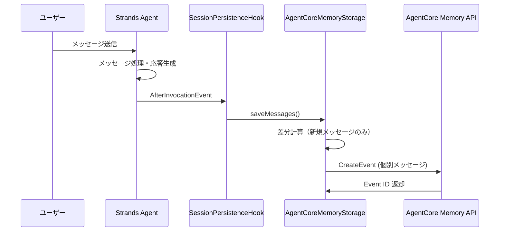
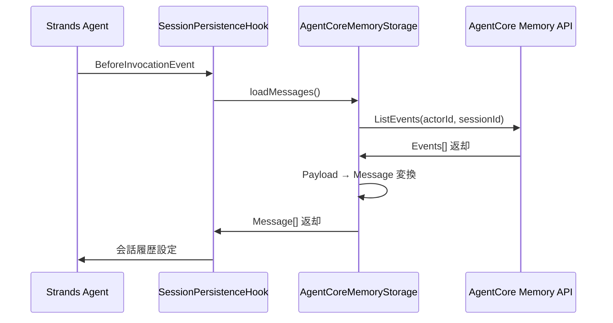

# AgentCore Memory 統合ガイド

## 概要

このドキュメントでは、Amazon Bedrock AgentCore Memory を使用した会話履歴の永続化について説明します。

## AgentCore Memory の構造

### 階層関係

```
Memory Resource (STM_Memory_20250922_163320-976U2Y9LvO)
├── Actor (user_123)
│   ├── Session (chat_session_abc)
│   │   ├── Event (message_1)
│   │   ├── Event (message_2)
│   │   └── Event (message_3)
│   └── Session (chat_session_xyz)
│       ├── Event (message_1)
│       └── Event (message_2)
└── Actor (user_456)
    └── Session (chat_session_def)
        ├── Event (message_1)
        └── Event (message_2)
```

### 各要素の説明

| 要素 | 説明 | 例 |
|------|------|-----|
| **Memory** | AgentCore Memory リソース | `STM_Memory_20250922_163320-976U2Y9LvO` |
| **Actor** | ユーザーを一意に識別するID | `user_alice_123` |
| **Session** | 会話セッションを一意に識別するID | `chat_20241220_1130` |
| **Event** | 実際の会話データ（ユーザー/アシスタントのメッセージ） | USER: "こんにちは" |

## データフロー

### 1. 会話履歴の保存



### 2. 会話履歴の読み込み



## API マッピング

### CreateEvent（メッセージ保存）

```typescript
// Strands Message
{
  role: 'user',
  content: [{ type: 'text', text: 'こんにちは' }]
}

// ↓ 変換

// AgentCore Event Payload
{
  memoryId: 'STM_Memory_20250922_163320-976U2Y9LvO',
  actorId: 'user_alice_123',
  sessionId: 'chat_20241220_1130',
  eventTimestamp: 1703001600000,
  payload: [{
    conversational: {
      content: { text: 'こんにちは' },
      role: 'USER'
    }
  }]
}
```

### ListEvents（会話履歴取得）

```typescript
// リクエスト
{
  memoryId: 'STM_Memory_20250922_163320-976U2Y9LvO',
  actorId: 'user_alice_123', 
  sessionId: 'chat_20241220_1130',
  includePayloads: true,
  maxResults: 100
}

// レスポンス
{
  events: [
    {
      eventId: '1234#abcd',
      payload: [{
        conversational: {
          content: { text: 'こんにちは' },
          role: 'USER'
        }
      }]
    }
  ]
}
```

## 実装戦略

### 1. 個別イベント保存方式

- **メリット**: 各メッセージが独立したイベントとして管理される
- **デメリット**: API 呼び出し回数が多くなる可能性

### 2. 差分検出ロジック

```typescript
async saveMessages(config: SessionConfig, messages: Message[]): Promise<void> {
  // 1. 既存のメッセージ数を取得
  const existingMessages = await this.loadMessages(config);
  
  // 2. 新規メッセージのみを抽出
  const newMessages = messages.slice(existingMessages.length);
  
  // 3. 新規メッセージを個別にCreateEvent
  for (const message of newMessages) {
    await this.createMessageEvent(config, message);
  }
}
```

### 3. セッションクリア

```typescript
async clearSession(config: SessionConfig): Promise<void> {
  // 1. セッションの全イベントを取得
  const events = await this.listEvents(config);
  
  // 2. 各イベントを個別に削除
  for (const event of events) {
    await this.deleteEvent(config, event.eventId);
  }
}
```

## 環境設定

### 必須環境変数

```bash
# Memory リソース ID
AGENTCORE_MEMORY_ID=STM_Memory_20250922_163320-976U2Y9LvO

# AWS リージョン
AWS_REGION=us-east-1
```

### IAM 権限

```json
{
  "Version": "2012-10-17",
  "Statement": [
    {
      "Effect": "Allow",
      "Action": [
        "bedrock-agentcore:CreateEvent",
        "bedrock-agentcore:ListEvents", 
        "bedrock-agentcore:DeleteEvent"
      ],
      "Resource": "arn:aws:bedrock-agentcore:us-east-1:988417841316:memory/STM_Memory_20250922_163320-976U2Y9LvO"
    }
  ]
}
```

## ファイル構成

```
packages/agent/src/session/
├── types.ts                    # 既存: SessionConfig, SessionStorage
├── file-session-storage.ts     # 既存: ファイルベース実装
├── converters.ts              # 新規: 型変換ユーティリティ
├── agentcore-memory-storage.ts # 新規: AgentCore Memory実装
└── index.ts                   # 更新: Storage 切り替えロジック
