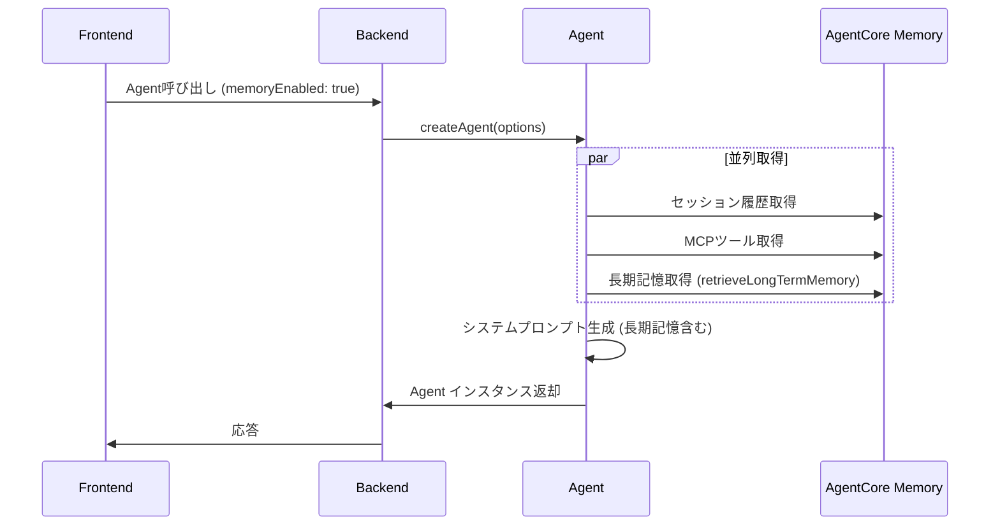

# 長期記憶統合ガイド

## 概要

AI Agentに長期記憶（Long-term Memory）を統合し、ユーザーの過去の会話や好みを学習・活用できるようになりました。

## 機能

- **セマンティック検索**: ユーザーの最新メッセージに関連する長期記憶を自動取得
- **並列処理**: セッション履歴とMCPツールと同時に長期記憶を取得し、ネットワークコストを削減
- **システムプロンプト統合**: 取得した長期記憶を自動的にシステムプロンプトに組み込み
- **フロントエンドとの連携**: Frontend の `memoryStore` で長期記憶のON/OFF制御

## アーキテクチャ



## 環境設定

### 必須環境変数

```bash
# Memory リソース ID
AGENTCORE_MEMORY_ID=STM_Memory_20250922_163320-976U2Y9LvO

# AWS リージョン
AWS_REGION=us-east-1
```

## 使用方法

### 1. Agent作成時に長期記憶を有効化

```typescript
import { createAgent } from './agent.js';

const agent = await createAgent(hooks, {
  // 基本設定
  modelId: 'anthropic.claude-sonnet-4-5-20250929-v1:0',
  
  // セッション復元
  sessionStorage: storage,
  sessionConfig: { actorId, sessionId },
  
  // 長期記憶設定
  memoryEnabled: true,                    // 長期記憶を有効化
  memoryContext: 'ユーザーの最新メッセージ', // 検索クエリ
  actorId: 'user_alice_123',              // ユーザーID
  memoryTopK: 10,                         // 取得件数（デフォルト: 10）
});
```

### 2. Frontend からの呼び出し

```typescript
// memoryStore から設定を取得
const { isMemoryEnabled } = useMemoryStore();

// Agent 呼び出し時にメモリ設定を渡す
const response = await invokeAgent({
  message: userMessage,
  sessionId: currentSessionId,
  memoryEnabled: isMemoryEnabled,  // フロントエンドの設定
  memoryContext: userMessage,      // ユーザーの最新メッセージ
});
```

## システムプロンプトへの組み込み

長期記憶が取得されると、システムプロンプトに以下のセクションが自動追加されます：

```
## User Context (Long-term Memory)
以下はこのユーザーについて過去に学習した情報です。この情報を踏まえて、ユーザーの好みや状況に適した応答を心がけてください。

1. ユーザーはPythonプログラミングが好きで、特にデータサイエンス分野に興味がある
2. 過去にAWS Lambda関数の実装について質問していた
3. プロジェクトでは常に型安全性を重視している
...

これらの情報を適切に活用し、ユーザーに寄り添った対話を行ってください。
```

## パフォーマンス最適化

### 並列取得による高速化

従来の逐次処理：
```typescript
// 従来（逐次処理）
const savedMessages = await storage.loadMessages(config);  // 500ms
const mcpTools = await mcpClient.listTools();              // 300ms
const memories = await retrieveLongTermMemory(...);        // 400ms
// 合計: 1200ms
```

並列処理による最適化：
```typescript
// 最適化後（並列処理）
const [savedMessages, mcpTools, memories] = await Promise.all([
  storage.loadMessages(config),     // 500ms
  mcpClient.listTools(),            // 300ms  } 並列実行
  retrieveLongTermMemory(...),      // 400ms
]);
// 合計: 500ms（最も遅い処理時間）
```

**削減時間: 約700ms（58%削減）**

## API リファレンス

### retrieveLongTermMemory

```typescript
async function retrieveLongTermMemory(
  memoryId: string,      // AgentCore Memory ID
  actorId: string,       // ユーザーID
  query: string,         // 検索クエリ
  topK?: number,         // 取得件数（デフォルト: 10）
  region?: string        // AWSリージョン（デフォルト: us-east-1）
): Promise<string[]>     // 長期記憶の配列
```

### CreateAgentOptions

```typescript
interface CreateAgentOptions {
  // ...既存のオプション
  
  // 長期記憶参照用
  memoryEnabled?: boolean;    // 長期記憶を有効化するか
  memoryContext?: string;     // 検索クエリ
  actorId?: string;           // ユーザーID
  memoryTopK?: number;        // 取得件数（デフォルト: 10）
}
```

## トラブルシューティング

### 長期記憶が取得されない

1. **環境変数の確認**
   ```bash
   echo $AGENTCORE_MEMORY_ID
   ```

2. **IAM権限の確認**
   ```json
   {
     "Effect": "Allow",
     "Action": [
       "bedrock-agentcore:RetrieveMemoryRecords",
       "bedrock-agentcore-control:GetMemory"
     ],
     "Resource": "arn:aws:bedrock-agentcore:*:*:memory/*"
   }
   ```

3. **ログの確認**
   ```
   [MemoryRetriever] 長期記憶を取得中: actorId=user_123, query=..., topK=10
   [MemoryRetriever] X 件の長期記憶を取得しました
   ```

### 新規ユーザーの場合

新規ユーザーで長期記憶が存在しない場合、以下のログが出力されます：

```
[MemoryRetriever] 長期記憶が存在しません（新規ユーザー）
```

これはエラーではなく、正常な動作です。空配列 `[]` が返され、Agent初期化は継続されます。

## ベストプラクティス

1. **検索クエリの選択**
   - ユーザーの最新メッセージをそのまま使用
   - 要約せず、原文を使うことでより正確なセマンティック検索が可能

2. **取得件数の調整**
   - デフォルト: 10件
   - 長い会話履歴が想定される場合: 5件程度に削減
   - 詳細な文脈が必要な場合: 15-20件に増加

3. **Frontend との連携**
   - ユーザーが長期記憶を無効化できるUI制御を実装
   - `memoryStore.isMemoryEnabled` で制御

## 関連ドキュメント

- [AgentCore Memory 統合ガイド](./agentcore-memory.md)
- [セッション管理](../src/session/README.md)
